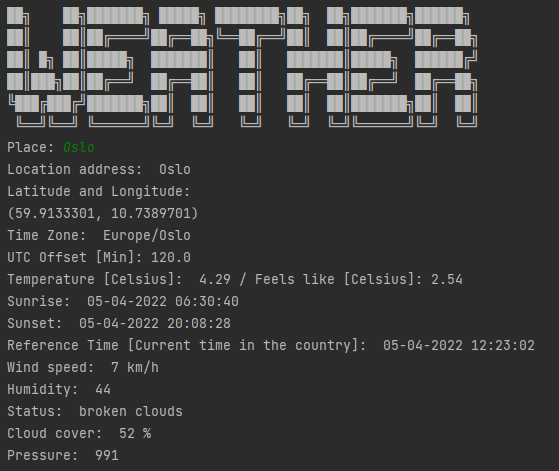

# Open Weather Map Projekt
Das ist ein Programm, welches über OWM die Wetterdaten jeder Stadt ausgeben kann. Sehr schwierig war, die richtige Zeit ausgeben zu lassen, 
da OWM die Uhrzeit nach der Zeitzone UTC±0 ausgibt. Deshalb habe ich mithilfe einiger dritter Bibliotheken den UTC Offset der 
Stadt bestimmt und diesen dann der ausgegebenen Zeit dazugerechnet. So kann ich auch die aktuelle Uhrzeit der Stadt angeben. 
Gedacht ist das Programm aber eigentlich um die Wetterdaten abzurufen. Diese Wetterdaten kommen von der API von [Open Weather Map](https://openweathermap.org/).
Der Output sieht wie folgt aus:

